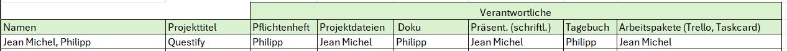

# Daily Log 21.01.25

## Heute

- [X] ~~*Fertigstellung WebUI*~~ [21.01.2025-14:10:03]

## Recap / Bilanz

- Web-UI fertiggestellt
- Fehler in Abfrage für verfügbare Quests behoben
- Testen der Implementierten Features

## Notes

| Datum      | Meilenstein                                |
| ---------- | ------------------------------------------ |
| 12.11.2024 | Erstellung Pflichtenheft abschließen       |
| 10.12.2024 | Fertigstellung der Datenbank               |
| 14.01.2025 | Fertigstellung WebUI                       |
| 21.01.2025 | Tests und Anpassungen                      |
| 28.01.2025 | Vervollständigung der Projektdokumentation |

- DB Aufbau
  

- Grundideen
  - Anwendung die Mitarbeiter in einem Unternehmen durch 'Attention Loop'-Techniken zu sonst eher stupiden Arbeiten motiviert.
  - regelmäßiges Erfüllen der Aufgaben wird mit digitalen Abzeichen und Statuswerten Belohnt
  - web-based UI um mit möglichst vielen Geräten kompatible zu sein (cross Plattform)
  - Role-based-access System für Team-Quests
  - DB für User Data/Fortschritt

- Nutzwertanalyse/Rechtfertigung
  - Steigerung der Produktivität durch Motivation zu sonst unbeliebten Aufgaben

- Aufteilung
   

### Beispiel Achivements
- Early Bird -> Wird an Nutzer vergeben, die frühzeitig mit ihren Aufgaben beginnen.
  - Typ: Vor 9:00 abgeschlossene Aufgaben
  - Value: 10

- XP-Hunter -> Belohnung für das Erreichen eines hohen Erfahrungspunkestatus.
  - Typ: Gesamt XP
  - Value: 1.000.000

- Knowledge Seeker -> Für Mitarbeiter, die an Schulungen und Lernquests teilnehmen.
  - Typ: abgeschlossene Quests aus der Kategorie 'Fortbildung'
  - Value: 10

- Taskmaster -> Anerkennung für das Abschließen vieler Aufgaben in kurzer Zeit.
  - Typ: abgeschlossene Quests in einer Woche
  - Value: 20

### Conditions
- "completedBeforeTime" -> in_test
- "totalXP" -> in_test
- "completedInAWeek" -> in_test
- "completedInADay" -> in_test 
- "completedCategoryLerning" -> in_test

### Links

[Prisma Docs](https://www.prisma.io/docs/getting-started/quickstart-sqlite)

[Pflichtenheft](../24.10.29/Pflichtenheft_Questify.md)

[Pflichtenheft Gliederung](../24.10.29/Gliederung_Pflichtenheft.pdf)

[Lastenheft](../24.10.29/Lastenheft_Questify.md)
<!-- -> https://chatgpt.com/share/6720dfe6-d86c-800a-bf53-1f82d712e43f -->

[Konzept](<../24.11.05/Konzept Questify.md>)
<!-- -> https://chatgpt.com/share/672a177d-a9a8-800a-bdff-bf8994686894 -->

[KanBan Bord](https://trello.com/b/6GTg28qt/gid-projekt-jean-michel-philipp)
