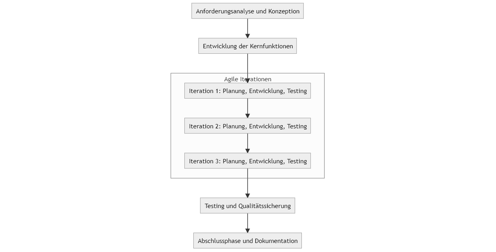

## Questify Dokumentation

## Inhalt

- Questify Dokumentation -> Seite 0
- Inhalt -> Seite 0

1. Einleitung
   1.1. Zielsetzung des Projekts -> Seite 0
   1.2. Projektumfang -> Seite 0
   1.3. Motivation und Hintergrund -> Seite 0
2. Projektplanung
   2.1. Projektziele -> Seite 0
   2.2. Meilensteine und Zeitrahmen -> Seite 0
   2.3. Ressourcenplanung -> Seite 0
   2.4. Risikoanalyse und -management -> Seite 0
3. Projektmethodik
   3.1. Vorgehensweise und Arbeitsmethoden -> Seite 0
   3.2. Technologische Grundlagen -> Seite 0
   3.3. Werkzeuge und Software -> Seite 0
   3.4. Teamstruktur und Zusammenarbeit -> Seite 0
4. Durchführung des Projekts
   4.1. Analysephase -> Seite 0
   4.2. Designphase -> Seite 0
   4.3. Implementierungsphase -> Seite 0
   4.4. Testphase -> Seite 0
   4.5. Abnahme und Implementierung -> Seite 0
5. Ergebnisse und Evaluation
   5.1. Erzielte Ergebnisse -> Seite 0
   5.2. Analyse und Interpretation der Ergebnisse -> Seite 0
6. Fazit
   6.1. Zusammenfassung der Projektergebnisse -> Seite 0
   6.2. Ausblick und mögliche Weiterentwicklungen -> Seite 0
7. Anhang
   7.1. Glossar -> Seite 0
   7.2. Quellenverzeichnis -> Seite 0

## Einleitung

### 1.1. Zielsetzung des Projekts

Unsere Arbeit an der Questify-Plattform fokussierte sich auf drei zentrale Aspekte. Erstens sollte die Plattform eine benutzerfreundliche Web-Oberfläche bieten, die es den Nutzern ermöglicht, einfach und unkompliziert auf die Plattform zuzugreifen. Zweitens sollte die Plattform über eine Datenbank mit vordefinierten Aufgaben und Erfolgen verfügen, die den Nutzern klare Ziele und Anreize bietet. Drittens sollte die Plattform automatisch digitale Abzeichen und Erfahrungspunkte vergeben und diese für die Nutzer sichtbar machen, um ihre Fortschritte und Erfolge zu dokumentieren.

### 1.2. Projektumfang

Dieses Projekt verfolgt das Ziel, eine webbasierte Plattform zur Mitarbeitermotivation zu entwickeln, die es Führungskräften ermöglicht, Aufgaben in Form von „Quests“ zu erstellen und gezielt an Teams oder spezifische Bereiche zuzuweisen.

Mitarbeiterinnen und Mitarbeiter werden für das regelmäßige Erfüllen dieser Quests mit rein digitalen Abzeichen sowie Erfahrungspunkten belohnt, die ihren Fortschritt und ihre Erfolge sichtbar machen. Der Quest-Fortschritt, offene Quests sowie erworbene Abzeichen können jederzeit über eine benutzerfreundliche Web-Oberfläche eingesehen werden. Diese ist intuitiv gestaltet und kann von jedem Gerät mit Internetzugang und einem modernen Browser genutzt werden, unabhängig davon, ob es sich um einen PC, ein Tablet oder ein Smartphone handelt.

Die Plattform setzt auf eine leistungsstarke Datenbanktechnologie, die eine stabile Performance und Ausfallsicherheit auch bei parallelen Zugriffen von bis zu 500 Nutzern gewährleistet.

### 1.3. Motivation und Hintergrund

Die Entwicklung dieser Applikation basiert auf der Beobachtung, dass in vielen Unternehmen mit überwiegend administrativen oder generischen Büroaufgaben ein Rückgang der Mitarbeitermotivation festgestellt wird. Gerade repetitive Tätigkeiten, wie das Verarbeiten von Anfragen, das Führen von Protokollen oder das regelmäßige Erstellen von Berichten, führen oft zu einem Gefühl der Monotonie und sinkendem Engagement bei den Mitarbeitenden. Dies kann langfristig zu einem Rückgang der Arbeitsleistung, einer geringeren Mitarbeiterzufriedenheit und im schlimmsten Fall zu einer erhöhten Fluktuation führen.

Die entwickelte Plattform adressiert diese Herausforderungen, indem sie spielerische Elemente aus der Gamification nutzt, um den Arbeitsalltag der Mitarbeitenden interessanter und motivierender zu gestalten. Indem wiederkehrende Tätigkeiten in „Quests“ umgewandelt werden, erhalten diese Aufgaben eine klare Zielsetzung und werden mit einem positiven Erlebnis verbunden. Mitarbeitende können durch den Abschluss von Quests ihre Fortschritte sichtbar machen und Belohnungen in Form von digitalen Abzeichen sammeln.

Dieser Ansatz fördert nicht nur die intrinsische Motivation, sondern schafft auch ein Gefühl der Anerkennung und Zielerreichung. Zusätzlich werden Teams und Abteilungen animiert, gemeinsam auf Ziele hinzuarbeiten, wodurch die Zusammenarbeit gestärkt wird. Die Plattform bietet somit eine innovative Möglichkeit, monoton wahrgenommene Tätigkeiten mit einem höheren Sinn zu verbinden und die allgemeine Arbeitsmoral nachhaltig zu steigern.

## Projektplanung

### 2.1. Projektziele

### 2.2. Meilensteine und Zeitrahmen

Als Zeitrahmen für das Projekt wurden 80 Stunden mit zwei Programmierern angesetzt. Die Aufgaben wurden in vier Phasen unterteilt.
Die Meilensteine und Phasen wurden wie folgt definiert:

| **Kostenkategorie**                       | **Beschreibung**                                                                  | **Dauer**      | **Verantwortlich**                     |
| ------------------------------------------- | ----------------------------------------------------------------------------------- | ---------------- | ---------------------------------------- |
| **1. Anforderungsanalyse und Konzeption** | - Anforderungsdefinition und Zielsetzung - Prototypen und Skizzen erstellen    | 8 Stunden      | Philipp Leyser und Jean-Michel Reupsch |
| **2. Entwicklung der Kernfunktionen**     |                                                                                   |                |                                        |
| 2.1 Backend-Entwicklung                   | - Implementierung der Geschäftslogik und Datenbankanbindung                      | 14 Stunden     | Jean-Michel Reupsch                    |
| 2.2 Frontend-Entwicklung                  | - Entwicklung der Benutzeroberfläche und Integration der Gamification-Elemente   | 14 Stunden     | Philipp Leyser und Jean-Michel Reupsch |
| 2.3 Funktionale Features                  | - Implementierung des Punktesystems, Aufgabenmanagement und Belohnungen           | 8 Stunden      | Philipp Leyser                         |
| **3. Testing und Qualitätssicherung**    |                                                                                   |                |                                        |
| 3.1 Usability-Testing                     | - Testen der Benutzerfreundlichkeit und Anpassung der Oberfläche                 | 8 Stunden      | Jean-Michel Reupsch                    |
| 3.2 Funktionalitäts-Testing              | - Überprüfung der Kernfunktionen (Punkte, Belohnungen, Aufgabenmanagement)      | 4 Stunden      | Philipp Leyser                         |
| 3.3 Geräte- und Browser-Kompatibilität  | - Tests auf verschiedenen Endgeräten und Browsern                                | 4 Stunden      | Philipp Leyser                          |
| **4. Abschlussphase und Dokumentation**   |                                                                                   |                |                                        |
| 4.1 Nutzerdokumentation                   | - Erstellung einer Anleitung für Benutzer und Übergabe an die Personalabteilung | 4 Stunden      | Philipp Leyser und Jean-Michel Reupsch |
| 4.2 Feedbackrunde und Anpassungen         | - Feedback sammeln und eventuelle Nachjustierungen vornehmen                      | 4 Stunden      | Philipp Leyser und Jean-Michel Reupsch |
| **Gesamtkosten**                          |                                                                                   | **80 Stunden** |                                        |

Aus den Aufgaben in den Projektphasen ergibt sich eine Zeitaufteilung von 40h pro Entwickler. Die Aufgaben wurden so verteilt, dass beide Entwickler an allen Phasen beteiligt sind und sich gegenseitig unterstützen können.

### 2.3. Ressourcenplanung

Für die Entwicklung der Questify-Plattform standen zwei Entwickler zur Verfügung, die gemeinsam an der Umsetzung der Software arbeiteten. Jeder Entwickler hatte einen eigenen PC-Arbeitsplatz mit der erforderlichen Entwicklungsumgebung.

Als zentrale Entwicklungssoftware wurde Visual Studio Code eingesetzt, das unter der MIT-Lizenz frei verfügbar ist und eine effiziente Programmierung ermöglicht. Für die Datenhaltung wurde SQLite verwendet, das ebenfalls unter der MIT-Lizenz steht und eine schlanke, ressourcenschonende Lösung für die Anwendungsanforderungen bietet. Das Backend der Plattform basiert auf Node.js, das unter der gleichen Lizenz genutzt werden konnte und eine performante, skalierbare Architektur unterstützt.

Durch den gezielten Einsatz dieser Open-Source-Technologien konnten Lizenzkosten vermieden und eine flexible, zukunftssichere Entwicklungsumgebung geschaffen werden. Die vorhandenen Ressourcen wurden so organisiert, dass eine effiziente Zusammenarbeit und eine strukturierte Entwicklung über den gesamten Projektzeitraum gewährleistet waren.

### 2.4. Risikoanalyse und -management

Diese Risikomatrix setzt die einzelnen Meilensteine, die im Projektverlauf erreicht werden sollen, in Beziehung zu potenziellen Risiken, die den Erfolg des Projekts gefährden können.
Die Risiken sind in Kategorien eingeteilt und jeweils mit einer Bewertung versehen (Wahrscheinlichkeit [W: niedrig/mittel/hoch] und Auswirkung [A: niedrig/mittel/hoch]).

| **Meilenstein**                                                                     | **Potenzielle Risiken**                                                             | **Wahrscheinlichkeit (W)** | **Auswirkung (A)** | **Maßnahmen zur Risikominderung**                                                                   |
| ------------------------------------------------------------------------------------- | ------------------------------------------------------------------------------------- | ---------------------------- | -------------------- | ------------------------------------------------------------------------------------------------------ |
| **Anforderungsdefinition und Zielsetzung**                                          | Unklare oder unvollständige Anforderungen                                          | Mittel                     | Hoch               | Anforderungen frühzeitig mit allen Stakeholdern klären und dokumentieren.                          |
|                                                                                     | Änderungen der Anforderungen während der Entwicklung                              | Hoch                       | Mittel             | Änderungsmanagement einführen und spätere Anpassungen klar priorisieren.                          |
| **Prototypen und Skizzen erstellen**                                                | Design entspricht nicht den Erwartungen der Zielgruppe                              | Mittel                     | Mittel             | Zielgruppenanalysen und regelmäßiges Feedback von Stakeholdern einholen.                           |
|                                                                                     | Verzögerungen durch Iterationen im Design                                          | Mittel                     | Niedrig            | Klare Deadlines für Designphasen setzen und Kompromisse bei kleineren Details zulassen.             |
| **Implementierung der Geschäftslogik und Datenbankanbindung**                      | Probleme mit der Datenbankperformance bei parallelem Zugriff                        | Mittel                     | Hoch               | Datenbanktests unter Lastbedingungen durchführen und ggf. auf skalierbare Technologien setzen.      |
|                                                                                     | Fehler in der Geschäftslogik                                                       | Mittel                     | Hoch               | Code-Reviews und Unit-Tests einführen, um Fehler frühzeitig zu erkennen.                           |
| **Entwicklung der Benutzeroberfläche und Integration der Gamification-Elemente**   | Benutzeroberfläche ist nicht intuitiv oder kompliziert                             | Mittel                     | Mittel             | Usability-Tests mit Prototypen durchführen und Feedback iterativ einarbeiten.                       |
|                                                                                     | Gamification-Elemente wirken nicht motivierend                                      | Mittel                     | Mittel             | Psychologische Aspekte der Motivation berücksichtigen und Tests mit einer Fokusgruppe durchführen. |
| **Implementierung des Punktesystems, Aufgabenmanagement und Belohnungen**           | Punkte- und Belohnungssystem wird als unfair oder unklar wahrgenommen               | Mittel                     | Hoch               | Transparenz bei der Systemlogik sicherstellen und Feedback von Testgruppen einholen.                 |
|                                                                                     | Fehlerhafte Verknüpfung zwischen Aufgaben und Punkten                              | Niedrig                    | Mittel             | Systematische Tests und Validierung der Logik.                                                       |
| **Testen der Benutzerfreundlichkeit und Anpassung der Oberfläche**                 | Feedback der Nutzer führt zu größeren Anpassungsaufwänden                       | Hoch                       | Mittel             | Feedback frühzeitig einholen und iterativ Anpassungen vornehmen.                                    |
|                                                                                     | Probleme mit Barrierefreiheit                                                       | Mittel                     | Mittel             | Standards für Barrierefreiheit einhalten (z. B. WCAG) und gezielt testen.                           |
| **Überprüfung der Kernfunktionen (Punkte, Belohnungen, Aufgabenmanagement)**      | Kernfunktionen weisen unerwartete Fehler auf                                        | Mittel                     | Hoch               | Automatisierte Tests und gezielte manuelle Tests auf Hauptfunktionen durchführen.                   |
|                                                                                     | Zeitliche Verzögerungen durch notwendige Nachbesserungen                           | Hoch                       | Mittel             | Pufferzeiten in der Planung berücksichtigen.                                                        |
| **Tests auf verschiedenen Endgeräten und Browsern**                                | Inkompatibilitäten mit bestimmten Geräten oder Browsern                           | Hoch                       | Hoch               | Testsysteme mit verschiedenen Endgeräten und Browsern aufsetzen.                                    |
|                                                                                     | Performanceprobleme auf älteren Geräten                                           | Mittel                     | Mittel             | Optimierungen für gängige Gerätetypen und Mindestanforderungen kommunizieren.                     |
| **Erstellung einer Anleitung für Benutzer und Übergabe an die Personalabteilung** | Anleitung wird nicht als verständlich oder hilfreich wahrgenommen                  | Mittel                     | Mittel             | Benutzerzentrierte Sprache verwenden und Anleitungen vorab von Testnutzern prüfen lassen.           |
|                                                                                     | Übergabe an die Personalabteilung verzögert sich durch unklare Kommunikationswege | Niedrig                    | Mittel             | Übergabeprozess frühzeitig planen und Abstimmungen sicherstellen.                                  |

### Legende:

- **Wahrscheinlichkeit (W):** niedrig, mittel, hoch
- **Auswirkung (A):** niedrig, mittel, hoch

## Projektmethodik

### 3.1. Vorgehensweise und Arbeitsmethoden

Bei der Entwicklung der Questify-Plattform wurde ein agiler Ansatz gewählt, um flexibel auf Änderungen und neue Anforderungen reagieren zu können. Der agile Projektmanagementstil ermöglichte eine iterative Entwicklung, bei der regelmäßig funktionsfähige Zwischenstände präsentiert und evaluiert wurden. Dies förderte die kontinuierliche Einbindung der Stakeholder und erleichterte es, frühzeitig Feedback einzuholen und in den Entwicklungsprozess zu integrieren.

Die Arbeit wurde in überschaubare Sprints aufgeteilt, die jeweils eine Planungsphase, die Umsetzung und abschließende Tests umfassten. Durch diesen Ansatz konnten Risiken frühzeitig identifiziert und behoben werden. Zusätzlich wurde ein Fokus auf kollaboratives Arbeiten gelegt, bei dem sowohl die Personalabteilung als auch zukünftige Nutzer regelmäßig eingebunden wurden, um sicherzustellen, dass die Plattform den Anforderungen und Erwartungen entspricht.

Zu den eingesetzten Methoden gehörten tägliche Stand-up-Meetings, regelmäßige Retrospektiven zur Verbesserung der Arbeitsweise und Backlog-Priorisierungen, um sicherzustellen, dass die wichtigsten Features und Funktionen zuerst umgesetzt wurden.

### 3.2. Technologische Grundlagen

Die technologische Basis der Questify-Plattform wurde sorgfältig ausgewählt, um eine moderne, skalierbare und performante Anwendung zu gewährleisten:

- **Frontend**: Für die Benutzeroberfläche kommt JavaScript/TypeScript zum Einsatz, um eine reaktionsschnelle und interaktive Webanwendung zu entwickeln. Diese Technologien bieten Flexibilität und ermöglichen die Nutzung bewährter Frameworks und Bibliotheken zur Optimierung der Benutzerfreundlichkeit.
- **Backend**: Im Backend wird auf Node.js in Kombination mit TypeScript gesetzt. Diese Kombination bietet eine leistungsstarke Umgebung, die eine effiziente Verarbeitung von Anfragen sowie eine saubere und typsichere Codebasis sicherstellt.
- **Datenbank**: SQLite wurde als Datenbanktechnologie gewählt, um eine einfache Integration und zuverlässige Datenhaltung sicherzustellen. Die Leichtgewichtigkeit von SQLite ermöglicht einen reibungslosen Betrieb bei gleichzeitiger Unterstützung von parallelen Zugriffen bis zu 500 Nutzern.
  Diese Technologien wurden so kombiniert, dass sie eine stabile, sichere und erweiterbare Plattform bilden, die den Anforderungen moderner Webanwendungen entspricht.

### 3.3. Werkzeuge und Software

Für die Entwicklung der Questify-Plattform wurden folgende Werkzeuge und Softwarelösungen eingesetzt, um eine effiziente und strukturierte Arbeitsweise zu gewährleisten:

- **Entwicklungsumgebung**: Visual Studio Code diente als Hauptwerkzeug für die Softwareentwicklung. Die leichtgewichtige und anpassbare IDE bietet umfangreiche Funktionen wie Debugging, IntelliSense und eine Vielzahl von Erweiterungen, die den Entwicklungsprozess optimieren.
- **Versionskontrolle**: Die Versionskontrolle wurde mit Git umgesetzt. Dieses bewährte Werkzeug ermöglichte eine zuverlässige Nachverfolgung von Änderungen am Code sowie die Zusammenarbeit im Team über Branching- und Merging-Strategien.
- **Kommunikation und Zusammenarbeit**: Für die teaminterne Kommunikation und Abstimmung wurde Microsoft Teams genutzt. Durch die Integration von Chats, Videokonferenzen und Dateifreigaben konnte eine reibungslose Zusammenarbeit auch bei remote verteilten Teammitgliedern sichergestellt werden.
  Diese Werkzeuge trugen maßgeblich dazu bei, die Entwicklung der Plattform strukturiert, transparent und effektiv zu gestalten.

### 3.4. Teamstruktur und Zusammenarbeit

Die Teamstruktur von Questify setzt sich aus zwei Entwicklern zusammen, die gemeinsam an der Umsetzung der Plattform arbeiten. Die Aufgaben wurden so verteilt, dass beide Entwickler an allen Phasen beteiligt sind und sich gegenseitig unterstützen können.
Philipp Leyser hat sich insbesondere auf die Einrichtung der Backend- und Gamificationlogik konzentriert, während Jean-Michel Reupsch die Frontend-Entwicklung und die Integration der Web-Oberfläche übernommen hat. Beide Entwickler haben zusammengearbeitet und sich regelmäßig abgestimmt, um sicherzustellen, dass die Kommunikation von Front- und Backend reibungslos funktioniert.

## Durchführung des Projekts

### 4.1. Analysephase

In der Analysephase wurden die Anforderungen an die Questify-Plattform definiert und die Zielsetzung des Projekts festgelegt. Hierbei wurden die Bedürfnisse der Nutzer und Stakeholder identifiziert und in konkrete Anforderungen übersetzt. Die Analysephase diente als Grundlage für die weitere Planung und Umsetzung des Projekts.

### 4.2. Designphase

Die Designphase umfasste die Erstellung von Prototypen und Skizzen, um die Benutzeroberfläche und die Gamification-Elemente zu konzipieren. Hierbei wurden verschiedene Designansätze evaluiert und in enger Abstimmung mit den Stakeholdern optimiert. Das Design wurde iterativ weiterentwickelt, bis eine benutzerfreundliche und motivierende Oberfläche entstanden ist.
Schnell etablierte sich ein simples und intuitives Design, bei dem der Nutzer auf der Hauptseite lediglich über verfügbare Quests und Achievements informiert wird. Von einer Auflistung aller erledigten Quests wurde, aus Gründen der Übersichtlichkeit, abgesehen.

### 4.3. Implementierungsphase

Bei der Implementierung der Questify-Plattform wurden die Kernfunktionen und Features größtenteils gemäß der Planung umgesetzt. Die Funktionalitäten wurden in mehreren Sprints entwickelt und regelmäßig getestet, um eine hohe Qualität und Stabilität der Plattform sicherzustellen. Lediglich bei der Implementierung der Achievements mussten aufgrund von Zeitmangel Abstriche gemacht werden. Die Achievements beschränken sich daher auf das Erreichen einer vordefinierten Anzahl von Erfahrungspunkten bzw. die Erledigung einer bestimmten Anzahl von Quests in einem Zeitraum.

### 4.4. Testphase

Das Projekt wurde in mehreren Etappen getestet, um die Funktionalität und Benutzerfreundlichkeit der Plattform sicherzustellen. Dabei wurde vor allem auf manuelle Tests mit Mock-Daten gesetzt, um die Funktionalität der Plattform zu überprüfen. Die Tests wurden mit Postman durchgeführt, um die API-Endpunkte zu testen und sicherzustellen, dass die Daten, unabhängig von der Frontendlogik, korrekt verarbeitet werden. Die Tests wurden, ab einem gewissen Entwicklungsstand, regelmäßig durchgeführt, um Fehler frühzeitig zu erkennen und zu beheben.

## Ergebnisse und Evaluation

### 5.1. Erzielte Ergebnisse

In der für das Projekt zur Verfügung stehenden Zeit wurde ein funktionsfähiger Prototyp der Questify-Plattform entwickelt. Die Plattform ermöglicht es, Quests zu erstellen, zuzuweisen und zu erledigen. Die Nutzer können ihre Erfahrungspunkte einsehen und erhalten bei Erreichen bestimmter Meilensteine digitale Abzeichen. Der Prototyp ist web-basiert und kann von jedem Endgerät mit Internetzugang und einem modernen Browser genutzt werden.
Die Datenbank speichert Nutzerdaten und Fortschritte, um eine personalisierte Erfahrung zu ermöglichen. Nutzer werden mit einer simplen Username/Passwort-Kombination authentifiziert. Das Passwort wird gehashed und der Datenbank gespeichert, um die Sicherheit der Nutzerdaten zu gewährleisten.

### 5.2. Analyse und Interpretation der Ergebnisse

Die Gamification Elemente der Questify-Plattform haben sich als effektiv erwiesen, um die Motivation der Nutzer zu steigern. Durch die klare Zielsetzung und die sichtbaren Fortschritte wurden die Nutzer dazu angeregt, regelmäßig Quests zu erledigen und ihre Erfahrungspunkte zu sammeln. Achievements und digitale Abzeichen haben sich als motivierend erwiesen und die Nutzer dazu animiert, sich Ziele zu setzen und diese zu verfolgen. Allerdings wurde festgestellt, dass die Achievements zu simpel und wenig abwechslungsreich sind. In zukünftigen Versionen der Plattform sollten daher weitere Achievements und Belohnungen hinzugefügt werden, um die Motivation der Nutzer langfristig aufrechtzuerhalten. Nächste Schritte wären zudem, die Anwendung um die Möglichkeit zu erweitern, Quests zu erstellen und zu verwalten, sowie die Integration eines rollenbasierten Zugriffssystems (Role-based Access) für Team-Quests. So könnten Admin Nutzer Quests für bestimmte Teams oder Abteilungen erstellen.

## Fazit

### 6.1. Zusammenfassung der Projektergebnisse

Es ist uns gelungen einen funktionsfähigen Prototypen der Questify-Plattform zu erstellen. Dieser verfügt allerdings lediglich über die Grundfunktionen, die es Nutzern ermöglichen, Quests abzuschließen sowie Erfahrungspunkte und Achievements zu erhalten. Die Anwendung ist web-basiert und kann von jedem Endgerät mit Internetzugang und einem modernen Browser genutzt werden. Die Datenbank speichert Nutzerdaten und Fortschritte, um einen personalisierten Zugriff zu ermöglichen. Nutzer werden mit einer simplen Username/Passwort-Kombination authentifiziert. Das Passwort wird gehashed und der Datenbank gespeichert, um die Sicherheit der Nutzerdaten zu gewährleisten. Role-based-access wurde im Backend implementiert, wird jedoch noch nicht in der Frontend-Oberfläche genutzt.

### 6.2. Ausblick und mögliche Weiterentwicklungen

In zukünftigen Versionen der Questify-Plattform sollten vor allem der Role-based-access ausgebaut werden. So sollen Admin Nutzer Quests anlegen und bestimmten Teams oder Abteilungen zuweisen können. Zudem sollten weitere Achievements und Belohnungen hinzugefügt werden, um die Motivation der Nutzer langfristig aufrechtzuerhalten.

## Anhang

### 7.1. Glossar
- Gamification: Spieltypische Elemente und Prinzipien in einem spielfremden Kontext verwendet werden, um die Motivation und das Engagement der Nutzer zu steigern.

- Quest: Eine Aufgabe oder Herausforderung, die von den Nutzern erfüllt werden muss, um Erfahrungspunkte und Belohnungen zu erhalten.

- Achievements: Digitale Abzeichen oder Auszeichnungen, die von den Nutzern für das Erreichen bestimmter Ziele oder Meilensteine vergeben werden.

- Erfahrungspunkte: Digitale Punkte, die dem Nutzern für das Erfüllen von Quests und das Erreichen von Zielen verliehen werden. Die Erfahrungspunkte dienen als Maßstab für den Fortschritt der Nutzer.

### 7.2. Quellenverzeichnis
